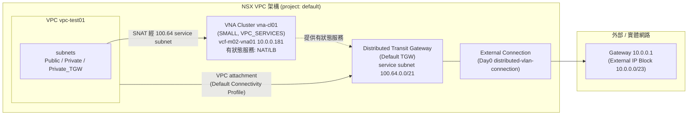
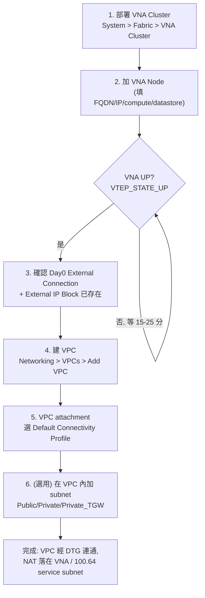

# VCF 9.1 NSX VNA + VPC 部署 — 圖解 / UI 版

> NSX Manager **UI 點選流程** + **架構/流程圖**。對應 API 流程見
> [vna-vpc-deploy-api.md](./vna-vpc-deploy-api.md)。
> 登入:`https://vcf-m02-nsx01.home.lab`(10.0.1.21),admin / VMware1!VMware1!。
> 參考(含產品實機截圖):[sdn-warrior — VCF 9.1 VNA and VPCs](https://sdn-warrior.org/posts/vcf9.1-vna-vpc/)。
>
> 註:本文用 mermaid 架構/流程圖。NSX 產品 UI 實機截圖請見上方 sdn-warrior 連結,或於本 lab UI 對照下方步驟。

## 架構圖

## 部署流程圖

---

## UI 逐步操作

### 步驟 1 — 部署 VNA Cluster
**位置**:`System > Fabric > VNA Cluster`(或 vCenter:`Configure > Networking > VNA Clusters`)→ **ADD VNA CLUSTER**

| 欄位 | 本 lab 填值 |
|---|---|
| Name | `vna-cl01` |
| Form Factor | **Small**(2 vCPU / 4 GB,PoC/lab)|
| Service Type | **VPC Services** |
| Overlay Transport Zone | `overlay-tz-mgmt-nsxt` |
| Password 管理 | 自管(輸入 admin/root/audit 密碼 = VMware1!VMware1!)|

### 步驟 2 — 加第一個 VNA Node（觸發 appliance 部署）
同一精靈內 **ADD NODE**:

| 欄位 | 填值 |
|---|---|
| FQDN / Hostname | `vcf-m02-vna01.home.lab` |
| Compute Manager | `vcf-m02-vc01.home.lab` |
| Cluster | `m01-cl01` |
| Datastore | `m01-cl01-ds-vsan01` |
| Management Network(Port Group)| `SDDC-DPortGroup-VM-Mgmt` |
| Management IP / Prefix / GW | `10.0.0.181` / `23` / `10.0.0.1` |

> 要 HA 就再 **ADD NODE** 一個(本 lab 用 1 台)。按 **SAVE / FINISH** → appliance VM 開始部署。

### 步驟 3 — 等 VNA 就緒
回到 VNA Cluster 列表,等狀態 **Up**(node VTEP 顯示 up)。inner vCenter 會看到 `vcf-m02-vna01` 開機。約 15–25 分鐘。

### 步驟 4 — 確認 External Connection（VCF Day0 已建)
**位置**:`Networking > Transit Gateways > Default Transit Gateway`
- 已有 **Day0 Transit Gateway Attachment**(對應 distributed-vlan-connection,即外部 VLAN 連線)
- **External IP Block** `10.0.0.0/23`(`Networking > IP Management > IP Address Blocks`)
> VCF 已 Day0 配好,通常不用動。要自建專屬 external block 會被 NSX 擋(不可與 Day0 /23 重疊)。

### 步驟 5 — 建 VPC
**位置**:`Networking > VPCs`(project = default)→ **ADD VPC**

| 欄位 | 填值 |
|---|---|
| Name | `vpc-test01` |
| IP Address Type | IPv4 |
> default project 下 VPC 走精簡,連線設定繼承 **Default VPC Connectivity Profile**。

### 步驟 6 — VPC 連到 DTG（VPC Attachment）
VPC 頁面 → **Connectivity / Attachment** → 選 **Default VPC Connectivity Profile**(已指向 Default TGW)。
> 沒這步 VPC 是 isolated,加 subnet 會失敗。attach 後系統自動建 NAT、可用 100.64 service subnet。

### 步驟 7 —（選用）VPC 內加 subnet
VPC → **Subnets** → **ADD SUBNET**:選 Access Mode(Public / Private / Private_TGW / Isolated)+ 大小(如 /28)。
> ⚠ **default project 的 Day0 IP block 不適合配 workload subnet**(external /23 被整段保留、private 對齊不符)。
> 要實際放 VM 的 workload VPC,建議在 **Networking > Projects** 建**自訂 Project(tenant)**,
> 配專屬 external/private IP block + connectivity profile,再於該 project 下開 VPC + subnet。

---

## 本 lab 完成狀態
| 元件 | 狀態 |
|---|---|
| VNA cluster `vna-cl01` / node `vcf-m02-vna01`(10.0.0.181)| **Up**,VTEP up |
| Default Transit Gateway | service subnet **100.64.0.0/21** |
| External Connection / IP Block | Day0(10.0.0.0/23 + distributed-vlan-connection)|
| VPC `vpc-test01` | 已 attach Default Connectivity Profile,NAT(DEFAULT+USER)就緒 |

> 想要可放 VM 的完整 workload VPC(自訂 project + 對齊 IP block + subnet),跟我說我可以接著建。
