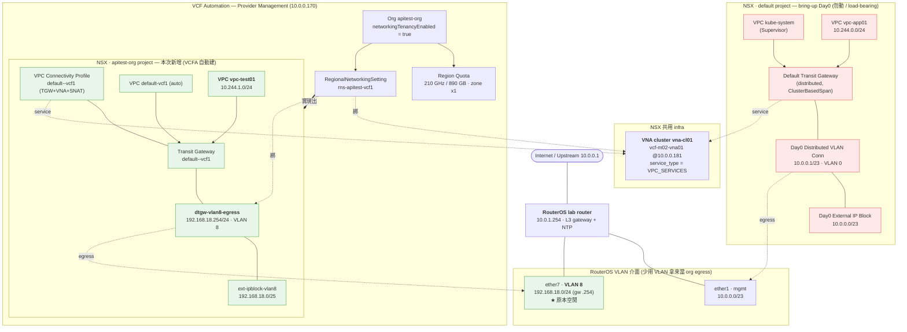
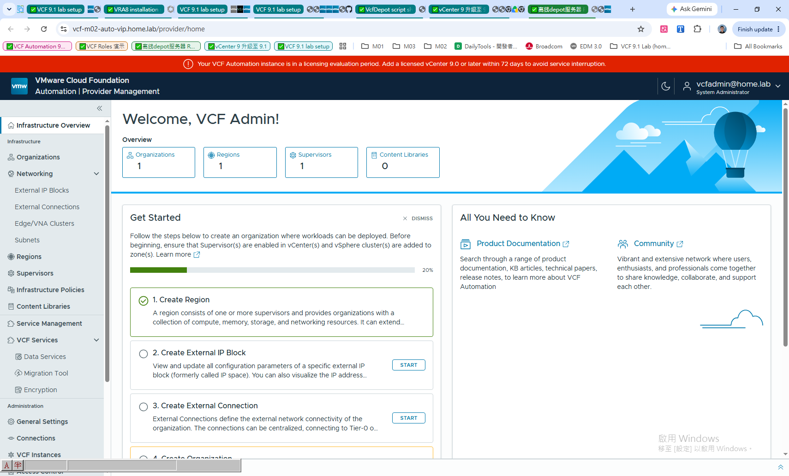
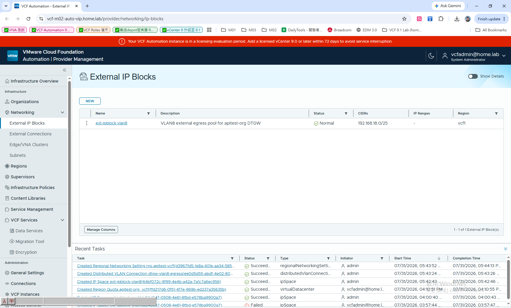
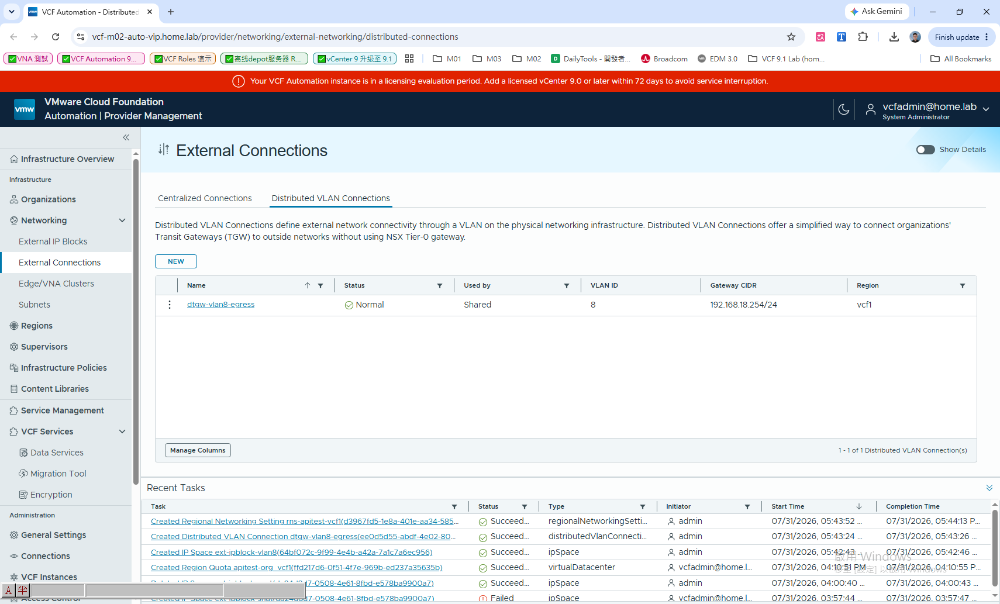
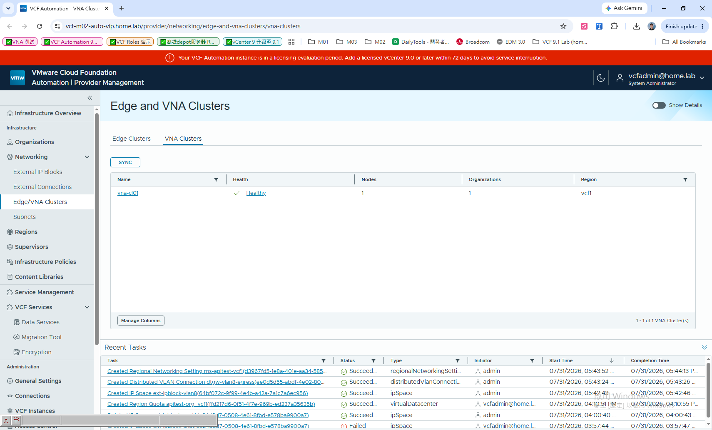
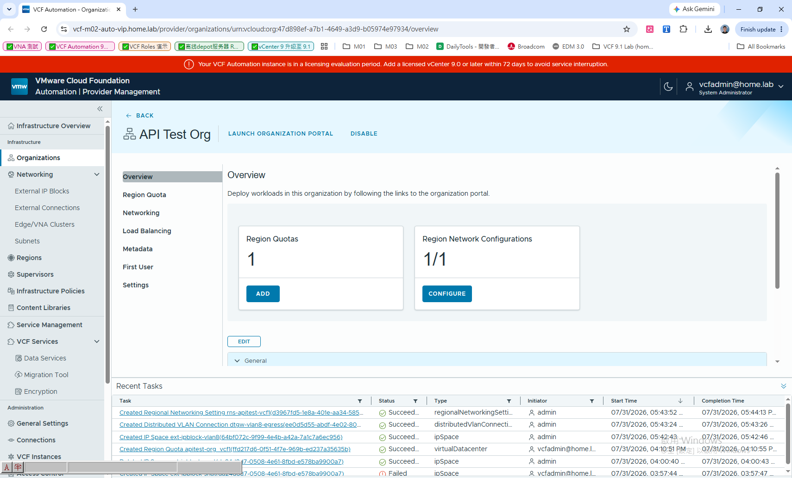

# VCF Automation 9.1 — 用 Distributed Transit Gateway (DTGW) 開通租戶 Org 的 VPC 網路

> **目標**：讓 VCF Automation 的租戶組織 `apitest-org` 能自助建立 VPC，並透過 **Distributed Transit Gateway (DTGW) + VNA** 取得對外連線。
> **成果**：Region Network Configuration `0/1 → 1/1`，租戶 VPC 已建立並 REALIZED，**且完全未動到 bring-up 的 Day0 網路**。
> **環境**：nested VCF 9.1 lab（內層 vCenter `10.0.1.19` / NSX `10.0.1.21` / VCFA VIP `10.0.0.170` / VNA `10.0.0.181`；外層 RouterOS `10.0.1.254` 為 L3 gateway）。
> **日期**：2026-07-31

---

## 0. 名詞

| 元件 | 說明 |
|---|---|
| **Distributed Transit Gateway (DTGW)** | 跑在 cluster host 上的分散式路由（edge-less），**不需要 NSX Edge / Tier-0**。 |
| **VNA Cluster（Virtual Network Appliance）** | 提供 VPC 服務式流量重導（service gateway / NAT）的 appliance。本 lab = `vna-cl01`（`vcf-m02-vna01` @ `10.0.0.181`）。 |
| **Distributed VLAN Connection** | Transit Gateway 對外 egress 的定義：把 TGW 綁到一段實體 VLAN（不經 Tier-0）。 |
| **External IP Block** | 對外（SNAT / VIP）用的 IP 位址範圍。 |
| **Regional Networking Setting** | 把某個 Org 的 region 網路接起來的 provider 物件（綁 connection + VNA）。 |
| **VPC** | 租戶自助建立、消費上述 DTGW 的私有雲網路。 |

---

## 1. 架構圖（配合本 lab 實際拓樸）

本次的核心是 **兩條獨立 egress 路徑**：既有的 **Day0（mgmt 10.0.0.0/23）** 保持不動，新的 **apitest-org 走空閒的 VLAN 8（192.168.18.0/24）**。



> **紅=Day0（既有、勿動）**；**綠=本次新增（apitest-org / VLAN 8）**。VNA cluster `vna-cl01` 為兩條路徑共用的 infra 物件。

---

## 2. 動手前的現況（API 驗證）

| 層 | 狀態 |
|---|---|
| NSX Default TGW | ✅ distributed（`ClusterBasedSpan`），Day0 attachment → Day0 Distributed VLAN Conn（10.0.0.1/23） |
| VNA cluster `vna-cl01` | ✅ UP（VTEP UP、storage READ_WRITE） |
| VCFA region `vcf1` | ✅ READY（接 NSX `vcf-m02-nsx01` + Supervisor `vcf-m02-sup01`，LB=VSPHERE_FOUNDATION） |
| **apitest-org 網路** | ❌ Region Network Config `0/1`、`networkingTenancyEnabled=false`、無 VPC |


*VCF Automation → Provider Management（System Administrator）。左側 Networking：External IP Blocks / External Connections / Edge/VNA Clusters / Subnets。*

---

## 3. 🔴 關鍵坑：Day0 網路是 load-bearing，**不能碰**

一開始的直覺是「在 mgmt 10.0.0.0/23 上讓 VCFA 建/認養 Day0 的 connection」。實測**此路不通、且危險**：

1. **VCFA 看不到 Day0 connection**（NSX-native、無 import 路徑），org 精靈 `Set Up Networking` 因此顯示「No Distributed VLAN Connections found」。
2. **在 mgmt 上新建一定撞 Day0**：
   > `Ip Block ... has CIDR overlapped with ff8f1a66 (Day0 10.0.0.0/23) which has IP reservation created by overlapping Distributed Vlan Connection Gateways. Please use other CIDRs.`
   連線本身也會因 gateway 相同而 `REALIZATION_FAILED`；`subnetExclusive=true` 又會變 dedicated、不能當 default egress。
3. **Day0 是現役使用中**：`Default TGW` 底下有 **Supervisor 的 `kube-system` VPC** 與 **`vpc-app01`（10.244.0.0/24）**。
   > ⚠️ **踩雷紀錄**：查 VPC 時用 `curl … | python3` 回空 —— **這台沒裝 python3**！誤讀成「0 VPC、可安全刪 Day0」，刪了 attachment+connection 才發現 Supervisor 在用 → 立即用備份 `day0-nsx-backup/` PUT 還原、驗證全數 REALIZED。**查 NSX JSON 一律用 PowerShell `ConvertFrom-Json` 或 `grep`，不要用 python3。**

**結論：Day0 保持原封不動，改為 apitest-org 開一條獨立 egress。**

---

## 4. ✅ 正解：拿 RouterOS 一段空閒 VLAN（VLAN 8）當 org 專用 egress

RouterOS `10.0.1.254` 的 VLAN 6/7/8（192.168.16/17/18.0/24，gw `.254`）**全空**（ARP 無鄰居、無 DHCP 租約，且有 connected route + 預設路由經 10.0.0.1 出去）。選 **VLAN 8 = 192.168.18.0/24**。
（查詢工具：`E:\9.1\tools\routeros-query.ps1`，RouterOS API 8728 唯讀版。）

### 4.1 建 External IP Block（SNAT pool，VLAN 8 子網）
```
POST /cloudapi/v1/ipSpaces
{ "name":"ext-ipblock-vlan8", "regionRef":{"id":"<region>"},
  "internalScopeCidrBlocks":[{"cidr":"192.168.18.0/25"}], "externalScopeCidr":"0.0.0.0/0" }
```
⚠️ CIDR 與 `ipAddressRanges` **不能重疊**（`overlapping internal scopes` 錯）→ 只給其一。→ **REALIZED**。


*`ext-ipblock-vlan8` = Normal，CIDR 192.168.18.0/25。*

### 4.2 建 Distributed VLAN Connection（VLAN 8，非 dedicated）
```
POST /cloudapi/v1/distributedVlanConnections
{ "name":"dtgw-vlan8-egress", "vlanId":8, "gatewayCidr":"192.168.18.254/24",
  "subnetExclusive":false, "regionRef":{"id":"<region>"}, "ipSpaceRef":{"id":"<ipSpace>"} }
```
⚠️ 非 dedicated **必須帶 `ipSpaceRef`**（缺 → `ipSpaceRef field value missing`）；`subnetExclusive` 保持 **false**（true 會變 dedicated、不能當 default）。→ PENDING → CONFIGURING → **REALIZED**。


*`dtgw-vlan8-egress` = Normal、Shared、VLAN ID 8、Gateway CIDR 192.168.18.254/24。*

### 4.3 確認 VNA cluster 已同步進 VCFA
```
POST /cloudapi/v1/virtualNetworkApplianceClusters/sync     # 事前跑一次
```

*`vna-cl01` 已被 VCFA 認到。*

### 4.4 建 Regional Networking Setting（把 org 網路接起來）
```
POST /cloudapi/v1/regionalNetworkingSettings
{ "name":"rns-apitest-vcf1", "orgRef":{"id":"<org>"}, "regionRef":{"id":"<region>"},
  "distributedVlanConnectionRef":{"id":"<dtgw-vlan8-egress>"},
  "virtualNetworkApplianceClusterRef":{"id":"<vna-cl01>"} }
```
→ CONFIGURING 幾分鐘 → **REALIZED**。完成後：`networkingTenancyEnabled=true`、VCFA `/v1/transitGateways` 出現 org TGW、NSX 建出 **apitest-org 專屬 project**（含 TGW `default--vcf1`、VPC Connectivity Profile 綁 `ext-ipblock-vlan8` + `vna-cl01`）。


*`API Test Org` — **Region Network Configurations 1/1**、Region Quotas 1；下方 Recent Tasks 為完整成功序列。*

---

## 5. Region Quota（compute 配額，另外設）
Org overview → **Region Quotas → ADD** → 選 region `vcf1` → **Assign and continue**（預設 limit-only）。
結果：Region `vcf1`、Status Ready、CPU 210.1 GHz、Memory 890.21 GB、Zones 1、Reservation 0。

---

## 6. 建立租戶 VPC（消費 DTGW+VNA）
建 Regional Networking Setting 時 VCFA 已自動建一個 `default-vcf1` VPC。再手動建一個具名 VPC 驗證：
```
PUT /policy/api/v1/orgs/default/projects/<apitest-org-projUUID>/vpcs/vpc-test01
{ "display_name":"vpc-test01", "private_ips":["10.244.1.0/24"], "ip_address_type":"IPV4", "resource_type":"Vpc" }
```
→ **REALIZED**。VPC 自動繼承 project 預設 connectivity profile（= VLAN 8 DTGW + VNA）。

**apitest-org project 現有 VPC：`default-vcf1`（172.30.0.0/16）+ `vpc-test01`（10.244.1.0/24）。**

---

## 7. 驗收（全 REALIZED、Day0 完好）

| 檢查 | 結果 |
|---|---|
| apitest-org Region Network Config | ✅ **1/1**（REALIZED） |
| VCFA 看得到 org TGW | ✅ Default Transit Gateway（org 專屬）+ dtgw-vlan8-egress |
| org project VPC | ✅ default-vcf1 + vpc-test01（REALIZED） |
| **Day0 dvc / attachment / external-block** | ✅ 完好（10.0.0.1/23、attachment=1） |
| **Day0 使用者 kube-system / vpc-app01** | ✅ 全 REALIZED、無 alarm |

---

## 附錄 A：關鍵 URN（本輪，重建會變）

| 物件 | URN / ID |
|---|---|
| Region `vcf1` | `urn:vcloud:region:d63528a3-74e9-470e-8f0b-b584a891372f` |
| Org `apitest-org` | `urn:vcloud:org:47d898ef-a7b1-4649-a3d9-b05974e97934` |
| VNA cluster `vna-cl01` | `urn:vcloud:virtualNetworkApplianceCluster:3fb43d89-493f-4f01-b2ae-63a14ad5e49d` |
| External IP Block `ext-ipblock-vlan8` | `urn:vcloud:ipSpace:64bf072c-9f99-4e4b-a42a-7a1c7a6ec956` |
| Distributed VLAN Conn `dtgw-vlan8-egress` | `urn:vcloud:distributedVlanConnection:ee0d5d55-abdf-4e02-8081-a3202c161b21` |
| Regional Networking Setting | `urn:vcloud:regionalNetworkingSetting:d3967fd5-1e8a-401e-aa34-58590b5627d0` |

## 附錄 B：Provider token（API 用）
```
POST https://10.0.0.170/cloudapi/1.0.0/sessions/provider
  -H "Host: vcf-m02-auto-vip.home.lab"  -H "Accept: application/json;version=40.1"
  -u 'admin@system:<PROVIDER_PASSWORD>'
→ 回應 header X-VMWARE-VCLOUD-ACCESS-TOKEN；之後帶 Authorization: Bearer <tok>
```
> ⚠️ ingress 用 Host header 路由 → 一定帶 FQDN（用 IP 直打回 404）。base path = `/cloudapi`。

## 附錄 C：Day0 備份 / 還原（救命）
備份：`day0-nsx-backup/`（6 個 NSX JSON）。還原 PUT-create 要用**乾淨最小 body**（去掉唯讀欄位，否則 404）：先還原 dvc `c8eaf2cc`，再還原 attachment `70f2c114`（`connection_path` 指回 dvc）。External block `ff8f1a66` 有 VPC 參照時 NSX 會擋刪除（= 保護）。
