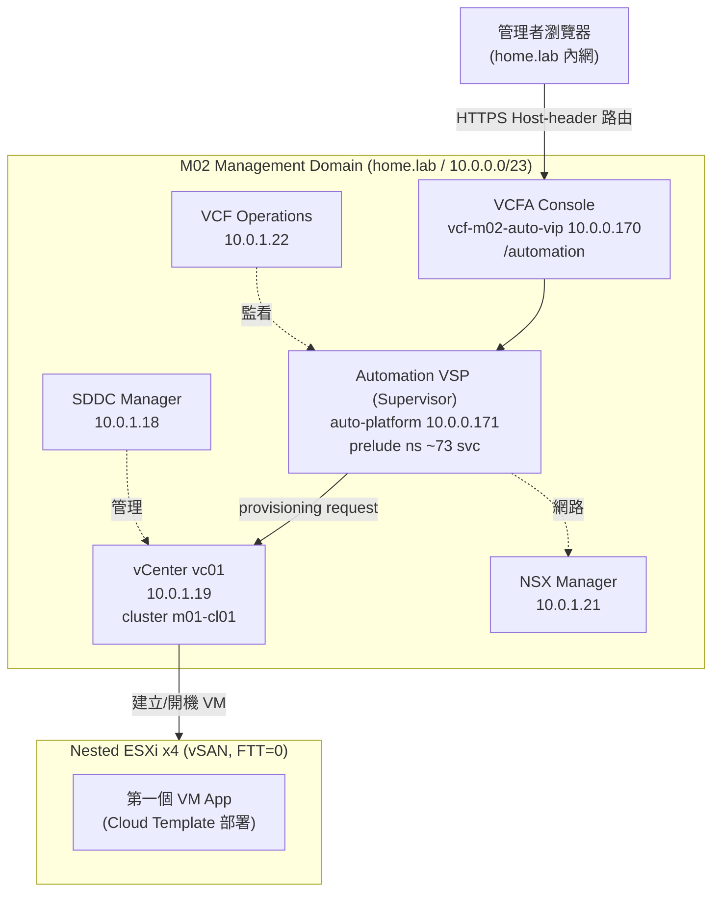
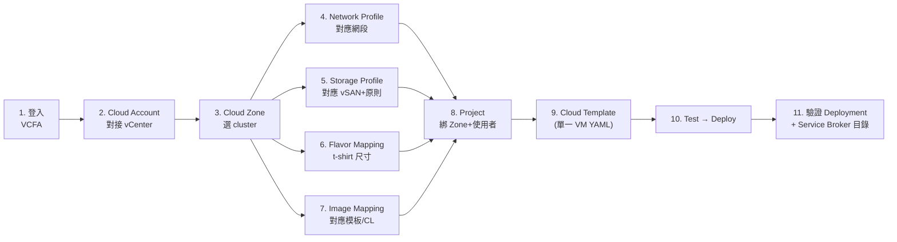
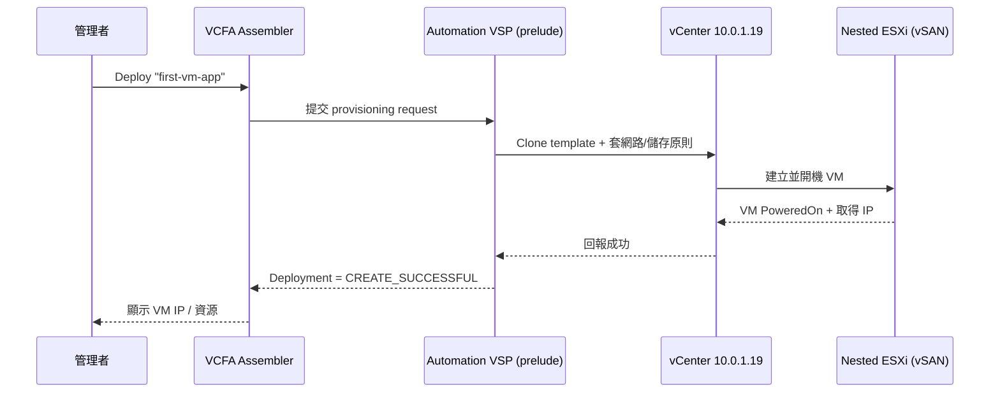

# VCF Automation 9.1 設定流程 — 起第一個 VM App

> Day-2：M02 bring-up 完成、VCF Automation（VCFA，舊名 Aria Automation）app 已 Running 之後，
> 第一次登入 VCFA 把基礎設施對接好，並用一個最小的 Cloud Template 部署**第一個 VM app**，
> 驗證 `VCFA → vSphere/VSP → VM` 的部署鏈路打通。
>
> 搭配 [../layer3-postbringup/k8s-access-and-checks.md](../layer3-postbringup/k8s-access-and-checks.md)（K8s/pod 健康檢查）
> 與 [../layer3-postbringup/vcf-operations-automation-deploy-troubleshooting.md](../layer3-postbringup/vcf-operations-automation-deploy-troubleshooting.md)（部署排錯）一起看。
>
> ⚠️ **UI 標籤註記**：VCF 9.1 把舊 Aria Automation 的 *Cloud Assembly / Service Broker / Orchestrator*
> 整併進單一 **VCF Automation** 主控台（左側導覽多半是 **Design / Infrastructure / Consume / Orchestrate**）。
> 本文沿用大家熟悉的 **Assembler（Cloud Assembly）/ Service Broker** 詞彙並標出對應位置；
> 你實機看到的分頁名稱若略有不同，照「動作」對應即可。畫面以實機為準，截圖待補（見 [§8](#8-截圖清單待補)）。

---

## 0. 本 lab 現況與存取資訊

| 項目 | 值 |
|---|---|
| VCFA Console URL | **https://vcf-m02-auto-vip.home.lab/automation**（auto-vip `10.0.0.170`） |
| **Provider 登入頁** | **https://vcf-m02-auto-vip.home.lab/tm/login/?service=provider** |
| **登入帳號** | **`admin`** / `VMware1!VMware1!`（⚠️ 不是 `administrator@vsphere.local`） |
| Automation platform VSP | `vcf-m02-auto-platform.home.lab` / `10.0.0.171`（consumption VSP，96GB） |
| VCFA app 跑在 | Automation K8s `prelude` namespace（~73 微服務），平台層 `vmsp-platform` |
| 對接的 vCenter（部 VM 用） | `vcf-m02-vc01` / `10.0.1.19`，cluster `m01-cl01` |
| NSX Manager | `vcf-m02-nsx01` / `10.0.1.21` |
| 管理網段 | `10.0.0.0/23`（mgmt，vlanId 0），domain `home.lab` |
| VCFA consumption IP pool | `10.0.0.241-249` |
| vSAN 儲存原則 | `m01-cl01 vSAN Storage Policy`（lab 為 **FTT=0**，nested 效能考量） |

> 新蓋元件密碼一律 = `VMware1!VMware1!`。完整明文 secrets 見 `inventory/secrets/lab.yaml`。

### 0.0 M02 元件 IP / 帳密總表（DNS 已驗證 2026-06-10）

| 元件 | FQDN | IP | 登入 |
|---|---|---|---|
| vCenter | vcf-m02-vc01.home.lab | `10.0.1.19` | `administrator@vsphere.local` / root |
| SDDC Manager | vcf-m02-sddcm01.home.lab | `10.0.1.18` | `admin@local` / `vcf` / root |
| NSX Manager | vcf-m02-nsx01.home.lab | `10.0.1.21` | `admin` / `audit` / root |
| VCF Operations | vcf-m02-ops01.home.lab | `10.0.1.22` | `admin` / root |
| Cloud Proxy (opsc) | vcf-m02-opsc01.home.lab | `10.0.1.24` | root |
| **VCF Automation (VIP)** | **vcf-m02-auto-vip.home.lab** | **`10.0.0.170`** | **`admin`** |
| VCF Automation platform | vcf-m02-auto-platform.home.lab | `10.0.0.171` | `vmware-system-user` (SSH) |
| VCF Mgmt Services (VSP) | vcf-m02-vsp01.home.lab | `10.0.0.172` | `vmware-system-user` (SSH) |
| ESXi host 01 | vcf-m02-esx01.home.lab | `10.0.1.14` | root |
| ESXi host 02 | vcf-m02-esx02.home.lab | `10.0.1.15` | root |
| ESXi host 03 | vcf-m02-esx03.home.lab | `10.0.1.16` | root |
| ESXi host 04 | vcf-m02-esx04.home.lab | `10.0.1.17` | root |

> 所有密碼 = `VMware1!VMware1!`。

⚠️ **Chrome 開 VCFA 卡 "Privacy error"（自簽憑證）的解**：VCFA leaf 由 VMCA 根 CA（`CN=CA, vsphere.local`，由 `vcf-m02-vc01` 簽）簽發。把該根 CA 匯入 Windows `LocalMachine\Root` 即放行（Chrome 用 Windows 信任根）。CDP/擴充無法跨過憑證攔截頁，所以一定要先信任憑證。

---

## 0.5 VCF 9.1 實機現況（2026-06-11 實測）— 先讀這段

> 第一次實際登入後發現 VCF 9.1 的 VCFA 與舊 Aria 不同，**部 VM 前有重要前置**。以下是實機觀察與正確路徑。

### 兩種 Organization（決定要不要 supervisor）

| Org 類型 | 需要 vSphere Supervisor？ | 用途 |
|---|---|---|
| **All Apps Organization** | ✅ 需要（+ NSX） | 現代雲原生 / VKS / namespace 消費 |
| **VM Apps Organization** | ❌ **不需要** | 傳統 vRA 體驗，**直接用 vCenter 部 VM** ← 本文目標 |

### 實測卡點：provider 入口被 no-supervisor 鎖住

- 以 `admin` 登入 `…/tm/login/?service=provider` 後，落在 **`/provider/no-supervisor`**（標題 "Welcome to VCF Automation"）。
- 該頁兩個動作：**"Enable Supervisor in Ops"**（→ `vcf-m02-ops01.home.lab/ui`）、**"Continue to VCF Automation"**（→ `/provider/home`）。
- **實測 `/provider/home`、`/provider/administration` 都被強制導回 `/provider/no-supervisor`** → 在「沒有 supervisor」的狀態下，**整個 provider portal 進不去**，連 Feature Flags 都走不到。

### 兩條可行路徑（擇一）

**路徑 A — VM Apps（輕量，不需 supervisor，推薦）**
1. VCFA **Feature Flags 啟用 `Classic Tenant Creation`**（⚠️ 本 build 的 Feature Flags 在 provider portal 內、被 no-supervisor 擋；可能需改用 **VCFA/VCD API** 設定）。
2. 建 **Organization → 選 "Organization for VM Apps"**。
3. 加使用者角色 → 加 **vCenter 整合**（`10.0.1.19`）→ 加 embedded **Orchestrator** 整合。
4. **Project → Image Mapping（需先有 vCenter 模板/Content Library）→ Blueprint → 部署 VM**（即 §3–§6 流程，那是 VM Apps 路徑）。

**路徑 B — 啟用 Supervisor（重型，官方正路）**
- 在 **vCenter**（非 Ops）叢集上 **Actions → Activate Supervisor**（Easy/Simplified 部署）：選 storage policy + 網路（DHCP 或 Static：port group / service CIDR / control-plane FQDN / IP range / mask / gateway），單 control-plane VM、無 LB 的最小組態。
- ⚠️ vSphere Client 在 9.1 **已移除 `/ui/app/workload-management` 路由**（直接開回 "Missing Route"），要從**叢集 Actions** 進。
- ⚠️ 本 nested lab 的 supervisor/etcd 效能是已知「硬牆」（見 [bring-up 排錯](../layer3-postbringup/vcf-operations-automation-deploy-troubleshooting.md)），啟用可能很慢/不穩。

### 實測各 UI 的截圖可行性（給後續補圖參考）

| UI | 登入 | 截圖 | 備註 |
|---|---|---|---|
| VCF Operations `ops01/ui` | SSO 自動帶入 | ✅ 可（視窗需有尺寸） | Manage→Fleet Management 有 Certificates/Passwords/Identity；首頁 Inventory：1 DC/1 Cluster/4 Host/13 VM |
| vCenter `vc01/ui` | administrator@vsphere.local | ✅ 可 | Workload Management 從叢集 Actions 進 |
| VCFA Automation SPA | `admin` provider | ❌ 不穩（`clip.scale`/不進 idle/自我重載換 tab） | 真實截圖難取，建議**手動截**；find 偶可用 |

---

## 0.6 Activate Supervisor — 手動執行 Runbook（路徑 B）

> ⚠️ 瀏覽器自動化無法穩定驅動 vSphere Client（精靈多頁、會自我重載），**建議在 vSphere Client 手動執行**。以下值已對本 lab 查好（IP 經 ping 確認空、閘道確認活著，2026-06-11）。

**入口**：vSphere Client（`https://vcf-m02-vc01.home.lab/ui`，`administrator@vsphere.local`）→ Hosts & Clusters → 選叢集 **`m01-cl01`** → **右鍵 / ACTIONS → Activate Supervisor**（9.1 已移除 `/ui/app/workload-management` 路由，務必從叢集 Actions 進）。選 **Easy / Simplified（single cluster）**。

| 欄位 | 填這個 | 備註 |
|---|---|---|
| Cluster | `m01-cl01` | 唯一叢集 |
| Storage Policy（control plane） | `m01-cl01 vSAN Storage Policy`（FTT=0） | lab 既有 vSAN 原則 |
| Management Network | mgmt 的 vDS portgroup（元件所在 10.0.0.0/23） | 與 vc/nsx/sddc 同網 |
| Network mode | **Static** | lab 無 DHCP 較可控 |
| Control Plane 起始 IP | **`10.0.0.190`** | 保留 **.190–.194 共 5 個**，已驗證空 |
| Subnet Mask | `255.255.254.0`（/23） | mgmt 為 /23 |
| Gateway | **`10.0.0.1`** | 已 ping 確認活著 |
| DNS | `10.0.0.200`，搜尋網域 `home.lab` | 本 lab DNS |
| NTP | `10.0.0.200` | 同 DNS 主機 |
| Service CIDR | 預設 `10.96.0.0/24` | 內部，留預設 |
| Workload Network IP range | `10.0.0.195–199`（如需） | 已驗證空；Easy 流程或與 mgmt 共用 |
| Control plane API FQDN | 選填（可留空用 VIP） | — |

**送出前**：Review 頁確認上述值 → **Activate / Finish**。

⚠️ **風險與前置**：本 nested lab 的 supervisor/etcd 是已知「硬牆」（vSAN I/O 慢 → etcd wal_fsync 高 → 控制平面 crashloop）。啟用**可能很慢或失敗**。建議先確保：vSAN 預設原則 **FTT=0**、nested ESXi **CPU/Mem reservation**、HA admission control 視情況關閉（見 [bring-up 排錯](../layer3-postbringup/vcf-operations-automation-deploy-troubleshooting.md)）。Activate 後到 supervisor `Running` 在此 lab 可能要很久，需耐心監看 etcd 健康（見 [k8s-access-and-checks](../layer3-postbringup/k8s-access-and-checks.md)）。

**Supervisor `Running` 後**：回 VCFA provider（`/tm/login/?service=provider`，`admin`）→ no-supervisor 頁應消失 → 即可建 Organization、Project、部署第一個 VM（§1 之後）。

---

## 0.7 ✅ 實際達成（2026-06-11）— 第一個 VM 已部署並開機（全 API）

> UI 驅動不了、supervisor 被 NSX Edge 擋、IaaS API 需另一層租戶 token —— 最後**全程用 API** 把「第一個 VM」做出來並開機。以下是**實際跑通**的步驟（非理論）。

**A. 解鎖 VM Apps 路徑（VCD API，provider token）**
```bash
# 認證：POST /cloudapi/1.0.0/sessions/provider  basic admin@system，Accept: application/json;version=40.1
#       → token 在回應 header X-VMWARE-VCLOUD-ACCESS-TOKEN
# ① 開 feature flag：GET 後改 enabled:true，PUT /cloudapi/1.0.0/featureFlags/urn:vcloud:featureflag:CLASSIC_TENANT_CREATION
# ② 建 VM Apps org：POST /cloudapi/1.0.0/orgs  {"name":"lab-vmapps","isEnabled":true,"isClassicTenant":true}
```

**B. 弄一個可部署映像（Photon OS 5.0 → Content Library，vCenter REST）**
```bash
# 下載 https://packages.vmware.com/photon/5.0/GA/ova/photon-hw15-5.0-dde71ec57.x86_64.ova (307MB)
# 建庫 POST /api/content/local-library (storage_backings: datastore-15)
# 建 item POST /api/content/library/item (type ovf)
# 開 session POST /api/content/library/item/update-session  {"library_item_id":"<item>"}   ← bare，不要 create_spec
# 加檔 POST /rest/com/vmware/content/library/item/updatesession/file?~action=add
#        {"update_session_id":"<sid>","file_spec":{"name":"...ova","source_type":"PUSH"}}  ← 參數名 update_session_id
#        → 回 upload_endpoint.uri
# 上傳 PUT --upload-file ...ova <uri>
# 完成 POST /api/content/library/item/update-session/<sid>?action=complete
```

**C. 部署 VM（vCenter OVF deploy）**
```bash
# 查網路鍵 POST /api/vcenter/ovf/library-item/<item>?action=filter {"target":{"resource_pool_id":"resgroup-10"}} → networks:["None"]
# 部署 POST /api/vcenter/ovf/library-item/<item>?action=deploy
#   {"target":{"resource_pool_id":"resgroup-10","folder_id":"group-v4"},
#    "deployment_spec":{"name":"lab-first-vm","accept_all_EULA":true,
#       "network_mappings":{"None":"dvportgroup-24"},   ← map 物件，非陣列
#       "storage_provisioning":"thin"}}
# 開機 POST /api/vcenter/vm/<vmId>/power?action=start
```

**成果**：VM **`lab-first-vm`**（vm-93）**POWERED_ON**，Photon OS 5.0，接 `SDDC-DPortGroup-VM-Mgmt`（10.0.0.0/23），thin on vSAN。root 預設密碼 `changeme`（首登要改）。

| 物件 | ID |
|---|---|
| Cluster | `domain-c9`（m01-cl01）|
| Resource Pool | `resgroup-10` |
| VM Folder | `group-v4`（"vm"）|
| Datastore | `datastore-15`（vSAN）|
| VM Network | `dvportgroup-24`（SDDC-DPortGroup-VM-Mgmt）|
| Content Library / item | `lab-cl` / `photon5`（ovf）|
| VM Apps Org | `lab-vmapps`（isClassicTenant）|

> 註：這台 VM 經 **vCenter** 直接從 Content Library 部出（驗證映像管線、馬上有 VM）。要走 **VCFA 原生 blueprint**（IaaS API）還需破 IaaS 租戶 token（OAuth/CSP）— 留待後續。

### 0.1 架構：VCFA 在這個 lab 的位置



---

## 1. 登入 VCFA Automation Console

1. 瀏覽器開 **https://vcf-m02-auto-vip.home.lab/tm/login/?service=provider**
   （**務必用 FQDN**；VCFA 的 ingress 以 Host header 路由，用 IP `10.0.0.170` 會回 404）。
2. 以 provider 管理者 **`admin`** / `VMware1!VMware1!` 登入（⚠️ 不是 `administrator@vsphere.local`）。
3. 進入 VCF Automation 首頁（服務切換器可在 **Assembler / Service Broker / Orchestrator** 間切換）。

> **自簽憑證 "Privacy error"**：Chrome 擴充/CDP **無法**跨過憑證攔截頁（會「Cannot attach to this target」）。
> 解法 = 把 VMCA 根 CA 匯入 Windows `LocalMachine\Root`（見 [§0.0](#00-m02-元件-ip--帳密總表dns-已驗證-2026-06-10) 註）。
> 手動操作則點 **進階 → 繼續前往**。

📷 `images/vcfa-day2/01-login.png`、`images/vcfa-day2/02-home.png`

---

## 2. 設定流程總覽



> 順序心法：**先有資源（Cloud Account → Zone → Profiles/Mappings），再有專案（Project），最後寫藍圖（Template）部署**。

---

## 3. Infrastructure：把資源接好（Assembler ▸ Infrastructure）

### 3.1 Cloud Account（對接 vCenter）

`Assembler ▸ Infrastructure ▸ Connections ▸ Cloud Accounts ▸ ADD CLOUD ACCOUNT`

- 類型：**vCenter**
- vCenter IP/FQDN：`10.0.1.19`（`vcf-m02-vc01`）
- 帳密：`administrator@vsphere.local` / `VMware1!VMware1!`
- 接受憑證指紋 → 勾選要管理的 **Datacenter / cluster `m01-cl01`** → **可一併建立 Cloud Zone**（省下 3.2）。
- （選配）關聯 **NSX-T Cloud Account**：`10.0.1.21`，給 on-demand network/security 用。

> VCF 9.1 中管理域 vCenter 可能在部署時已自動註冊；若清單已有 `vc01` 就跳過、直接確認狀態為 *Enabled / 已同步*。

📷 `images/vcfa-day2/03-cloud-account.png`

### 3.2 Cloud Zone

`Infrastructure ▸ Configure ▸ Cloud Zones`
- 對應到 vCenter 帳號 + cluster `m01-cl01`。
- Placement policy：lab 用 **DEFAULT**（或 *Spread*）。
- 確認底下 **Compute（ESXi 主機）** 有被納入。

📷 `images/vcfa-day2/04-cloud-zone.png`

### 3.3 Network Profile

`Infrastructure ▸ Configure ▸ Network Profiles ▸ ADD`
- 綁 Cloud Account / Region。
- 最簡：加一個 **Existing network** = 管理網段對應的 vSphere portgroup（mgmt `10.0.0.0/23`）。
- 指定 **IP Range / DNS / Gateway**，或在 vCenter portgroup 走 DHCP。
- （進階）要 on-demand 網路再加 NSX overlay segment + T1。

> lab 求快可直接用既有 mgmt portgroup + 一段靜態 IP（建議避開既有元件，例：`10.0.0.231-239`）。

📷 `images/vcfa-day2/05-network-profile.png`

### 3.4 Storage Profile

`Infrastructure ▸ Configure ▸ Storage Profiles ▸ ADD`
- Cloud Account → 選 **vSAN datastore**。
- Storage Policy：選 lab 既有的 **`m01-cl01 vSAN Storage Policy`（FTT=0）**。
- 給這個 profile 一個標籤，例：`tier:standard`。

📷 `images/vcfa-day2/06-storage-profile.png`

### 3.5 Flavor Mapping（機器尺寸）

`Infrastructure ▸ Configure ▸ Flavor Mappings ▸ ADD`

| 名稱 | vCPU | 記憶體 |
|---|---|---|
| `small` | 1 | 2 GB |
| `medium` | 2 | 4 GB |

> lab 起步用 `small` 即可，避免吃掉 nested 資源。

📷 `images/vcfa-day2/07-flavor-mapping.png`

### 3.6 Image Mapping（作業系統映像）

`Infrastructure ▸ Configure ▸ Image Mappings ▸ ADD`
- 來源：vCenter 的 **VM Template** 或 **Content Library** 項目。
- 取一個名稱，例：`photon` → 對應到實際模板（如 `photon-5-template` 或 Ubuntu cloud image）。

> **前置需求**：vCenter 裡要先有一個可用的 Linux 模板/Content Library 映像。
> 若還沒有，先在 vCenter 匯入一個 Photon/Ubuntu OVA 並轉成模板（最小、開機快）。

📷 `images/vcfa-day2/08-image-mapping.png`

---

## 4. Project：建專案並指派資源

`Assembler ▸ Infrastructure ▸ Administration ▸ Projects ▸ NEW PROJECT`
- 名稱：`lab-demo`
- **Users**：把 `administrator@vsphere.local` 加為 *Administrator*。
- **Provisioning ▸ Cloud Zones**：加入 3.2 的 Cloud Zone，Priority `0`、可設 instance/memory 上限。

📷 `images/vcfa-day2/09-project.png`

---

## 5. 第一個 VM App：Cloud Template

`Assembler ▸ Design ▸ Templates（Cloud Templates）▸ NEW`
- Name：`first-vm-app`，Project：`lab-demo`。
- 用左側元件拖一個 **Cloud Agnostic / vSphere Machine** + 一個 **Network**，或直接貼下面 YAML。

### 5.1 最小單一 VM 的 Cloud Template（VMware Cloud Template / blueprint）

```yaml
formatVersion: 1
inputs:
  hostname:
    type: string
    title: VM 主機名稱
    default: lab-first-vm
resources:
  Cloud_Machine_1:
    type: Cloud.Machine
    properties:
      name: '${input.hostname}'
      image: photon          # 對應 §3.6 Image Mapping 名稱
      flavor: small          # 對應 §3.5 Flavor Mapping 名稱
      constraints:
        - tag: 'tier:standard'   # 對應 §3.4 Storage Profile 標籤
      networks:
        - network: '${resource.Cloud_Network_1.id}'
          assignment: static
  Cloud_Network_1:
    type: Cloud.Network
    properties:
      name: mgmt-net
      networkType: existing   # 用 §3.3 既有網段
```

> 想之後加 cloud-init、磁碟、多台或 NSX on-demand 網路，都從這份骨架往上疊。

📷 `images/vcfa-day2/10-cloud-template-canvas.png`、`images/vcfa-day2/11-cloud-template-yaml.png`

### 5.2 Test → Deploy

1. 右下 **TEST** → 跑 placement/網路/儲存驗證，應顯示綠色可放置。
2. **DEPLOY** → 給 deployment 命名（`first-vm-app-001`）→ 填 `hostname` input → 送出。
3. 進度看 **Assembler ▸ Resources ▸ Deployments**，或點 deployment 看 **History / Request** 逐步事件。

📷 `images/vcfa-day2/12-test-result.png`、`images/vcfa-day2/13-deploy-request.png`



---

## 6. 驗證部署成功

- **Assembler ▸ Resources ▸ Deployments**：`first-vm-app-001` 狀態 = **Create Successful**，
  點進去看到 VM 物件、配發的 IP（來自 §3.3 IP range）。
- **vCenter `10.0.1.19`**：`m01-cl01` 下出現新 VM、PoweredOn。
- （選配）**Service Broker**：把這個 template **發佈成 Content / 加進 Catalog**，
  之後可從 `Service Broker ▸ Catalog` 自助式部署（這就是「app 上架」）。

📷 `images/vcfa-day2/14-deployment-success.png`、`images/vcfa-day2/15-vm-in-vcenter.png`

---

## 7. 排錯速查

| 症狀 | 看哪裡 | 對策 |
|---|---|---|
| Console 開不出來 / 404 | 是否用 FQDN | 必須 `vcf-m02-auto-vip.home.lab`，非 IP |
| 登入失敗 | SSO 密碼 | 對 `inventory/secrets/lab.yaml`；註解別寫在密碼同一行 |
| Deploy 卡在 provisioning | Deployment ▸ History 事件 | 看 placement（zone/profile 是否齊）、vCenter 權限/憑證 |
| VM 建得出但拿不到 IP | Network Profile IP range / DHCP | 確認 range 未衝突、gateway/DNS 正確 |
| VCFA 服務本身異常 | `prelude` ns pods | 見 k8s-access-and-checks.md §2（節點 `10.0.0.243`） |
| 部署超慢/timeout | VSP etcd wal_fsync | nested vSAN 慢；確認 FTT=0 已套（見 troubleshooting 文件） |

---

## 8. 截圖清單（待補）

> 等瀏覽器/擴充接上 VCFA，或手動截圖後放到 `images/vcfa-day2/`，檔名對齊下表即可在本文渲染。

| 編號 | 檔名 | 畫面 |
|---|---|---|
| 01 | `01-login.png` | VCF SSO 登入頁 |
| 02 | `02-home.png` | VCF Automation 首頁 / 服務切換器 |
| 03 | `03-cloud-account.png` | 新增 vCenter Cloud Account |
| 04 | `04-cloud-zone.png` | Cloud Zone（cluster m01-cl01） |
| 05 | `05-network-profile.png` | Network Profile |
| 06 | `06-storage-profile.png` | Storage Profile（FTT=0） |
| 07 | `07-flavor-mapping.png` | Flavor Mapping |
| 08 | `08-image-mapping.png` | Image Mapping |
| 09 | `09-project.png` | Project lab-demo |
| 10 | `10-cloud-template-canvas.png` | Cloud Template 畫布 |
| 11 | `11-cloud-template-yaml.png` | Cloud Template YAML |
| 12 | `12-test-result.png` | TEST 驗證結果 |
| 13 | `13-deploy-request.png` | Deploy 請求進度 |
| 14 | `14-deployment-success.png` | Deployment 成功 |
| 15 | `15-vm-in-vcenter.png` | vCenter 中的新 VM |
