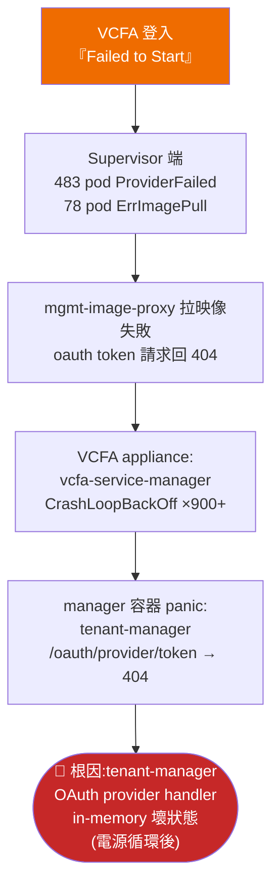
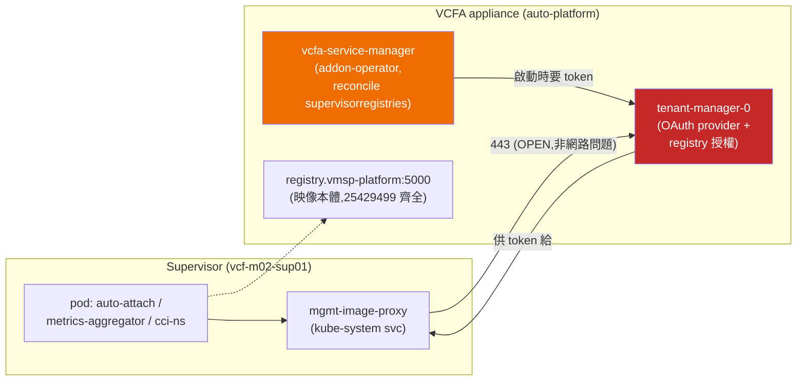
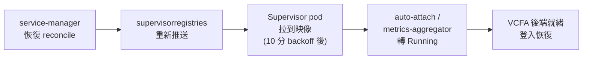

# VCFA「Failed to Start」排障與修復 RCA(2026-08-18)

> **一句話**:VCFA 登入報 *Failed to Start*,追到最後是 **tenant-manager 的 provider OAuth 端點進入壞狀態(回 404)** → `vcfa-service-manager` 開機即 panic(CrashLoopBackOff 900+ 次)→ registry 供不出映像 → Supervisor 端 483 個 pod `ErrImagePull` → VCFA 後端永遠起不來。
> **修法 = 在 VCFA appliance 上 `rollout restart statefulset tenant-manager`,再重啟 `vcfa-service-manager`。** 不用重部、不用動映像、不用改憑證。

---

## 1. 症狀

- VCFA console(`https://vcf-m02-auto-vip.home.lab/automation`)登入後報:
  > **Failed to Start** — An error occurred during the initialization. Accessing the application through an unsupported public URL or poor connectivity might cause this error.
- 前端端點其實都活著(`/automation/` 200、`/tm/login/` 200)→ 純後端初始化失敗。
- inner vCenter inventory 出現**大量** Supervisor pod-VM 殘骸:`metrics-aggregator-*` 483 台(僅 38 台開機)、`auto-attach-*`、`cci-ns-controller-manager-*`。

## 2. 故障鏈(由表層到根因)



`manager` 容器的 panic 原文(`kubectl -n prelude logs deploy/vcfa-service-manager -c manager`):

```
panic: endpoint https://tenant-manager.prelude.svc.cluster.local:443/oauth/provider/token failed: {
    "message":"Not Found",
    "url":"https://tenant-manager.prelude.svc.cluster.local/oauth/provider/token",
    "status":"404"
    }
```

Supervisor 端 pod 的錯誤(`kubectl describe pod`,同一個 404 的下游表現):

```
failed to fetch oauth token: unexpected status from GET request to
https://mgmt-image-proxy.kube-system.svc.cluster.local/oauth/provider/token?scope=repository%3A...%3Apull:
404 Not Found: ErrImagePull
```

## 3. 相關架構(映像供應鏈)



關鍵事實(排除清單的依據):

| 檢查 | 結果 | 意義 |
|---|---|---|
| Supervisor CP → VCFA VIP 10.0.0.170:443 | OPEN | 不是防火牆(排除 KB 429947) |
| `mgmt-image-proxy /v2/` | 401(正常要認證) | proxy 本身活著 |
| tenant-manager / service-manager 映像版本 | **同為 9.1.0-0100-25429499** | 不是版本漂移 |
| appliance registry(vmsp-platform:5000) | 25429499 映像**齊全** | 不是「缺映像」——那是下游假象 |
| appliance 部署時間 | 2026-07-12/13 原生 0100 | 不是「升級卡一半」 |
| VM snapshot | 無 | 無法 revert |
| tenant-manager 容器 | 週末電源循環時重啟過 | 壞狀態的可疑起點 |

## 4. 修復步驟(實測有效)

前提:SSH 進 VCFA appliance 用 **`vmware-system-user`**(root 直登被拒),sudo 後帶 kubeconfig。

```bash
ssh vmware-system-user@<auto-platform-IP>          # 本 lab: 10.0.0.243
sudo -i
export KUBECONFIG=/etc/kubernetes/admin.conf

# 1) 重啟 tenant-manager(根因元件;statefulset)
kubectl -n prelude rollout restart statefulset tenant-manager
kubectl -n prelude rollout status  statefulset tenant-manager --timeout=300s

# 2) 等 tenant-manager 內部服務完全起來(VCD 系 cell,~3-5 分鐘)

# 3) 重啟 vcfa-service-manager(讓它重新拿 token)
kubectl -n prelude rollout restart deploy vcfa-service-manager

# 4) 驗證:manager 容器不再 panic、開始 reconcile
kubectl -n prelude logs deploy/vcfa-service-manager -c manager --tail=20
#   期望看到:Reconciling ServiceRde / Handling active service /
#            Inactive service is ready for reactivation
```

實測:tenant-manager 重啟完成後,**連舊的 service-manager pod 都自己恢復 2/2 Running**(它的 backoff 重試在 tenant-manager 復原後就成功了),log 轉為正常 reconcile。

### 後續自癒鏈(修完後等 10-30 分鐘)



## 5. 驗證(2026-08-18)

- ✅ `vcfa-service-manager` 不再 panic,正常 reconcile(修復當下確認)
- ✅ tenant-manager `/oauth/provider/token` 恢復服務
- ⏳ Supervisor pod 轉 Running 與 VCFA 登入:等 backoff 週期後確認(本文件提交當下仍在收斂中)

> 收斂後的殘餘清理:Supervisor 端累積的數百個 `ProviderFailed` 死 pod-VM 需清理(等新 pod 全部 Running 後再清,`kubectl delete pod --field-selector status.phase=Failed -n <ns>`)。

## 6. 排障過程的教訓

1. **vCenter REST `/api/vcenter/vm` 偶爾回過期快取**(曾回「14 台全開」但實際 11 台已關)→ 報電源狀態一律 **govc + REST 交叉驗證**(見 vcf-power skill)。
2. **「缺映像/版本漂移」是下游假象** —— Supervisor 端看到 404/ErrImagePull 時,先上 VCFA appliance 看 `prelude` namespace 的 pod 健康,再下結論。
3. **CrashLoopBackOff 的 panic 訊息是過去式** —— panic 裡的 404 可能是「當時」的狀態;但本案例它持續為真,用「從別的 pod 打同一端點」驗證現在的狀態。
4. appliance 進不去 root SSH → 用 **vmware-system-user + sudo**;Supervisor 控制平面密碼用 vCenter 的 `/usr/lib/vmware-wcp/decryptK8Pwd.py` 取(工具名有尾碼 `d`)。
5. VCFA 在 VCF Ops UI **沒有**重部/移除入口(已部署狀態下),別浪費時間找;真要重部走 installer bring-up 層級。
6. 電源循環(週末關開機)後,**tenant-manager 可能活著但部分 handler 壞掉** —— readiness probe 測不到這種半死狀態。VCFA 開機後若服務異常,先重啟 `prelude` 的 tenant-manager + vcfa-service-manager 再說。

## 7. 參考

- [KB 422276 – svc-auto-attach.vksm pkgi failing(同服務、憑證鏈情境)](https://knowledge.broadcom.com/external/article/422276/the-svcautoattachvksmbroadcomcom-pkgi-is.html)
- [KB 429947 – Supervisor Services fail to reconcile via mgmt-image-proxy(防火牆情境,本案排除)](https://knowledge.broadcom.com/external/article/429947/supervisor-services-fail-to-reconcile-du.html)
- 本 lab 開關機自動化:`VCF-M02-開關機-Runbook.md`(週五 23:00 關 / 週一 06:00 開)
